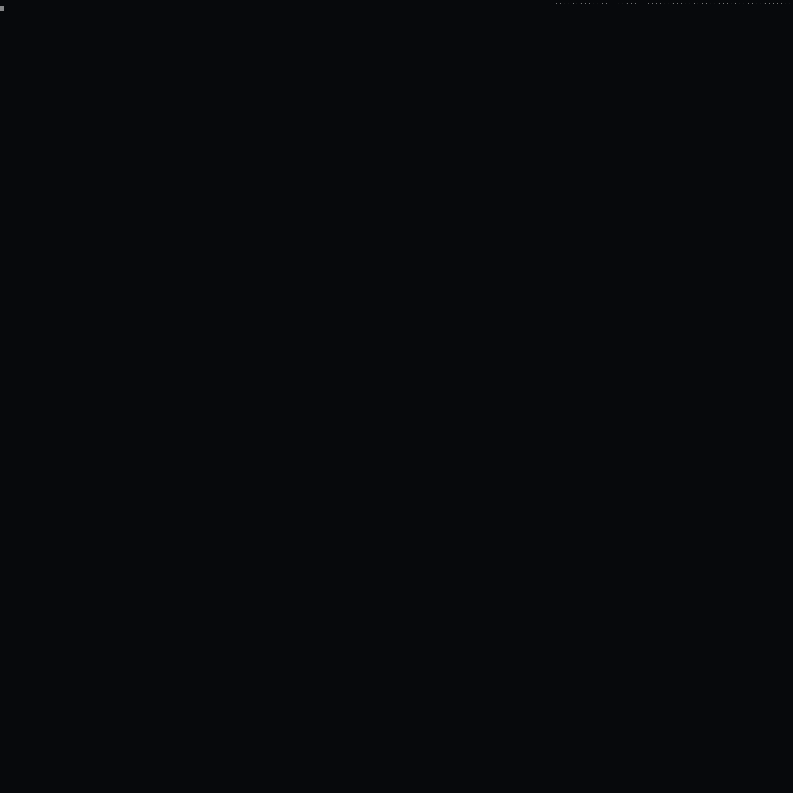
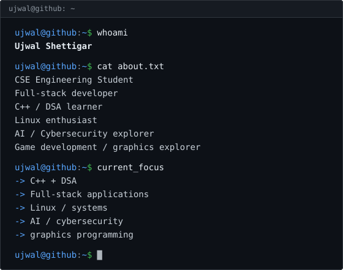
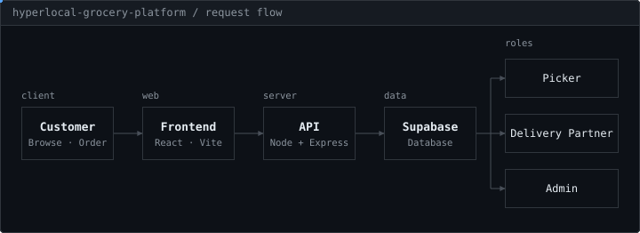
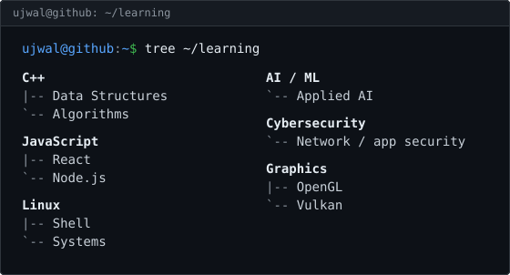
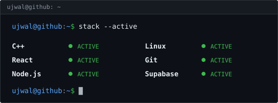
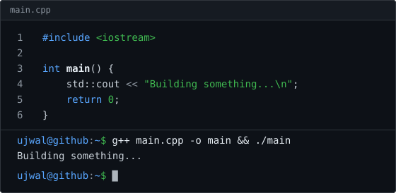

  <picture>
    <source media="(prefers-reduced-motion: reduce)" srcset="./assets/profile-ascii-1500-static.png">
    
  </picture>
  

  

  <a href="https://github.com/Ujwalushettigar"><code>github</code></a> ·
  <a href="https://linkedin.com/in/ujwal-shettigar"><code>linkedin</code></a> ·
  <a href="mailto:ujwalshettigar@gmail.com"><code>email</code></a> ·
  <a href="https://instagram.com/_ujwal_shettigar_"><code>instagram</code></a>

  

## CURRENTLY BUILDING

**Hyperlocal Grocery Platform.** A Blinkit-inspired grocery delivery platform with four roles: Customer, Picker, Delivery Partner and Admin.

## CURRENTLY LEARNING

## ACTIVE ENVIRONMENT

## TECH STACK

<table>
  <tr><td><code>languages</code></td><td></td></tr>
  <tr><td><code>frontend</code></td><td></td></tr>
  <tr><td><code>backend</code></td><td></td></tr>
  <tr><td><code>database / cloud</code></td><td></td></tr>
  <tr><td><code>tools</code></td><td></td></tr>
  <tr><td><code>game / graphics</code></td><td> <code>OpenGL</code></td></tr>
</table>

## PROJECTS

<code>PROJECT 01</code> · <code>PROJECT 02</code>

## CODE

## ACTIVITY

## CONTRIBUTIONS

<picture>
  <source media="(prefers-color-scheme: dark)" srcset="https://raw.githubusercontent.com/Ujwalushettigar/Ujwalushettigar/output/github-contribution-grid-snake-dark.svg">
  <source media="(prefers-color-scheme: light)" srcset="https://raw.githubusercontent.com/Ujwalushettigar/Ujwalushettigar/output/github-contribution-grid-snake.svg">
  
</picture>

## 2026 GOALS

- [ ] Strengthen C++ and DSA
- [ ] Build production-quality full-stack applications
- [ ] Improve Linux / system fundamentals
- [ ] Explore AI / ML
- [ ] Learn cybersecurity fundamentals
- [ ] Explore game development
- [ ] Learn graphics programming

## CONTACT

[ujwalshettigar@gmail.com](mailto:ujwalshettigar@gmail.com) · [linkedin.com/in/ujwal-shettigar](https://linkedin.com/in/ujwal-shettigar) · [github.com/Ujwalushettigar](https://github.com/Ujwalushettigar) · [instagram.com/_ujwal_shettigar_](https://instagram.com/_ujwal_shettigar_)
